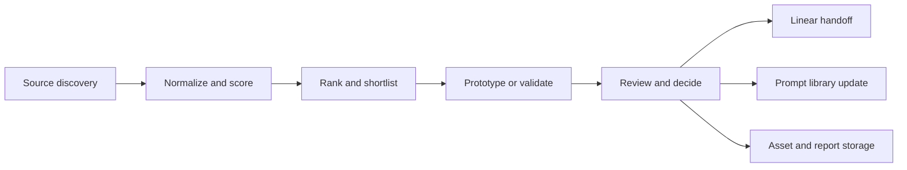

# Final Creative Production Research System

Linear: `SOR-44`

## Purpose

This document defines the operating system for turning creative technology research into reusable implementation work. It connects source discovery, scoring, prototyping, and handoff into one small, reviewable loop.

The system is designed to stay lightweight:

- Markdown stays the human-readable source of truth.
- Structured records can later move into a database or spreadsheet.
- Every automated step has a human review gate.
- Raw captures stay minimal and are only kept when they help verify a source.

## Operating Model

The loop is intentionally small:

1. Discover a source or workflow.
2. Verify the source.
3. Score it against the rubric.
4. Shortlist the strongest candidates.
5. Prototype only the best candidates.
6. Convert the result into a task, note, or reusable prompt.

## Data Model

The current repo is document-first, but the long-term model should support both markdown output and future database storage.

| Entity | Purpose | Core fields |
|---|---|---|
| `source` | Raw record for a tool, library, platform, or workflow source | `name`, `category`, `subcategory`, `source_type`, `official_url`, `repo_url`, `pricing`, `license`, `access_notes`, `verification_status`, `access_date` |
| `record` | Canonical cleaned version of a source | `normalized_name`, `aliases`, `summary`, `creative_value`, `integration_options`, `ai_capabilities`, `animation_capabilities`, `community_notes`, `maintenance_notes` |
| `score` | Ranking result for a record | `criterion_scores`, `weighted_score`, `gates_passed`, `risk_notes`, `recommendation` |
| `shortlist` | Category-based selection set | `category`, `rank`, `reason`, `follow_up_needed` |
| `prototype` | Small proof-of-concept test tied to a shortlist item | `prototype_type`, `input_brief`, `implementation_notes`, `output_links`, `screenshot_paths`, `cost_notes`, `result_status` |
| `handoff` | Delivery artifact for implementation | `target_repo`, `issue_links`, `recommended_next_step`, `acceptance_notes`, `open_questions` |
| `asset` | Stored output from research or prototypes | `path`, `file_type`, `source_reference`, `created_at`, `retention_note` |
| `document` | Human-readable narrative or policy | `title`, `scope`, `owner`, `related_records`, `last_reviewed_at` |

If this moves into a real database later, a simple relational shape works well:

- `sources` as the base table.
- `records` as the reviewed/normalized layer.
- `record_scores` for rubric output.
- `prototype_runs` for tests and screenshots.
- `documents` for reports, policies, and handoff notes.
- `tags` and join tables only if filtering needs grow beyond markdown search.

## Roles

| Role | Responsibility | Output |
|---|---|---|
| Research curator | Picks the next sources to inspect and keeps the queue focused | Short source list, scope note |
| Source verifier | Checks official docs, license, pricing, access constraints, and freshness | Verified record fields |
| Scoring agent | Applies the rubric consistently | Weighted score and rationale |
| Shortlist editor | Turns scores into category priorities | Ranked list with next steps |
| Prototype planner | Chooses which items deserve a proof-of-concept | Prototype brief and route/tasks |
| Prototype builder | Implements the small test or mock | Report, assets, screenshots, notes |
| Handoff author | Translates results into Linear and future implementation work | Issue links and recommendation |
| Human reviewer | Approves the final call on keep/test-later/drop | Decision and follow-up notes |

## Cadence

| Cadence | What happens | Why it matters |
|---|---|---|
| Daily | Review new sources, issues, and blockers | Keeps the queue fresh without drifting |
| Weekly | Re-score the best candidates and clear stale notes | Prevents the research set from going stale |
| Per prototype | Build one isolated proof-of-concept for the strongest candidate | Keeps testing cheap and comparable |
| Monthly | Refresh the source map and prune weak leads | Keeps the system focused on current tools |
| Ad hoc | Open a new Linear issue when a source becomes promising | Connects research directly to implementation |

## Review Workflow

1. Ingest a source or workflow into the source map.
2. Verify the source status using official docs first.
3. Classify the source using the crawling policy:
   - `allowed`
   - `api_preferred`
   - `manual_only`
   - `blocked`
   - `unknown`
4. Normalize the record and add aliases, pricing, licensing, and usage notes.
5. Score the record using the rubric and minimum gates.
6. Promote strong items into a shortlist.
7. Decide whether the item should be prototyped now or kept for later.
8. Create a Linear issue for any item that needs implementation.
9. Store the final note, asset links, and result report.

The review should never skip the human decision point for anything that could affect spend, legal exposure, or external writes.

## Source Refresh Strategy

The source map should be kept current through a layered refresh process:

1. Official docs and repo releases first.
2. API or registry metadata second.
3. Manual inspection for community-heavy or visually rich sources.
4. Crawl only when the ethical crawling policy says the source is `allowed`.
5. Recheck volatile fields on a schedule:
   - pricing
   - model availability
   - API versions
   - licensing
   - active maintenance

Low-confidence or stale records should be marked for review instead of silently reused.

## Prototype Pipeline

The prototype path is the bridge from research to implementation.

1. Choose a shortlist item with strong score and low enough integration risk.
2. Write a tiny prototype brief with a narrow success criterion.
3. Build the test in an isolated route, sandbox, or external workspace.
4. Capture screenshots, logs, notes, cost observations, and failure cases.
5. Decide `keep`, `test-later`, or `drop`.
6. Save the result to `prototype-results/`.
7. Convert the result into a Linear issue or implementation note if it is worth building.

Prototype rules:

- Keep the test small.
- Prefer one feature, one hypothesis, one outcome.
- Never let a prototype overwrite the main prompt-library experience.
- Document blockers as clearly as successes.

## Integration With Prompt Libraries

The prompt library is the downstream system that turns research into reusable assets.

Recommended flow:

- Research notes become prompt drafts or prompt library candidates.
- Useful prototype outcomes become tested prompt examples.
- The best research insights become reusable templates for new prompt packs.
- Any stable workflow pattern should be documented alongside the prompt example it supports.

Suggested handoff paths:

- `docs/creative-production-research/` for research notes and policies.
- `prompt-library/` for reusable prompt artifacts.
- `prototype-results/` for test reports.
- `assets/` for screenshots, generated media, and supporting files.

## Integration With Linear

Linear is the execution layer for implementation follow-through.

Use Linear for:

- tracking the next action after a shortlist decision
- opening prototype or implementation tasks
- linking result reports back to the source record
- marking blockers and follow-ups clearly

Each handoff issue should include:

- the source or prototype it came from
- the recommendation
- the acceptance criteria for the next step
- the expected file or route impact
- any known risk or limitation

## Integration With Automation Platforms

Automation should support the system, not take over judgment.

Good automation jobs:

- scheduled source refresh
- document generation from verified records
- stale-record reminders
- report rollups
- asset inventory checks

Automation should not:

- approve a source classification by itself
- write to external services without review
- bypass crawling policy limits
- auto-promote an item from research to implementation

## Asset Storage

Suggested storage layout:

- `assets/research/` for raw captures that need to be retained
- `assets/ai-generated/` for generated media and metadata
- `assets/prototypes/` for screenshots and prototype output
- `prototype-results/` for human-readable reports

Retention rules:

- keep only what is necessary for verification
- avoid storing secrets, cookies, auth files, or private content
- prefer structured metadata alongside the asset
- delete or quarantine anything that is no longer needed

## Future Creative Apps

This system should stay useful even as the repo grows into new products.

Future apps can plug into the same flow if they can:

- read the source maps
- consume the scoring rubric
- create a prototype or implementation issue
- store outputs in the standard asset folders
- produce a reviewable report for humans

That keeps the research layer reusable whether the next app is a prompt tool, a creative dashboard, a workflow assistant, or a visual generator.

## Handoff Checklist

Before a research item is considered finished:

- source record exists
- verification notes are saved
- score is recorded
- shortlist status is clear
- prototype result or rationale is documented
- Linear issue is linked
- output assets are stored
- follow-up is either closed or explicitly deferred

## Success Criteria

The system is working well when:

- research stays small and reviewable
- source records remain clean and comparable
- prototypes are cheap to run and easy to explain
- Linear tasks directly reflect the next action
- prompt-library work can reuse the research without redoing the analysis
- no step depends on hidden tribal knowledge
